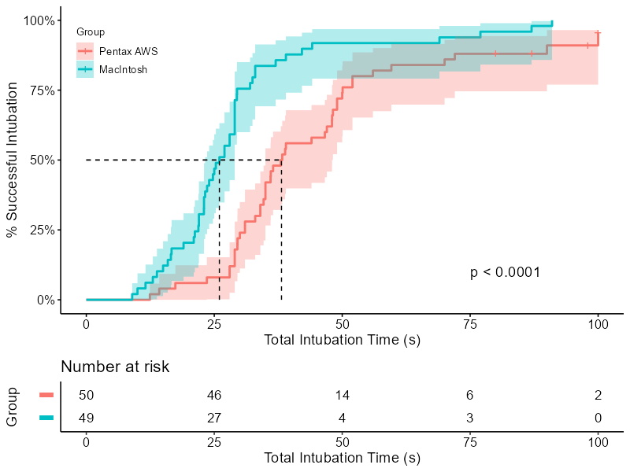

```{r setup, include=FALSE}
knitr::opts_chunk$set(echo = T)
```

```{r, echo = F, out.width="100%", fig.align='center'}

```

# Introduction

Randomized Controlled Trials (RCTs) are considered the gold-standard of medical research. When RCTs are properly conducted, one can infer causation and not just correlation. In this post, I use open data from the [medicaldata](https://higgi13425.github.io/medicaldata/index.html) r package to reproduce some of the results of an RCT.

The [paper](https://journals.lww.com/anesthesia-analgesia/Fulltext/2011/11000/A_Randomized_Comparison_Between_the_Pentax_AWS.24.aspx) we are going to reproduce is:

> A Randomized Comparison between the Pentax AWS Video Laryngoscope and the Macintosh Laryngoscope in Morbidly Obese Patients, *Anesthesia Analgesia 2011; 113: 1082-7*.

We are going to reproduce Table 1, Figure 2, and Table 2 (Figure 1 is a photo of the Pentax AWS device).

## A few important disclaimers

-   It is much easier to replicate the analysis when it is well explained and based on open data. Kudos to the authors of the paper and the authors of the [medicaldata](https://higgi13425.github.io/medicaldata/index.html) r package for their contribution to science and truth. None of this was possible without their generosity in sharing the data.

-   It is highly suggested to read the [paper](https://journals.lww.com/anesthesia-analgesia/Fulltext/2011/11000/A_Randomized_Comparison_Between_the_Pentax_AWS.24.aspx) , the [dataset description](https://www.causeweb.org/tshs/datasets/Laryngoscope%20Dataset%20Introduction.pdf), and the [codebook](https://www.causeweb.org/tshs/datasets/Laryngoscope%20Data%20Dictionary.pdf) first and keep them accessible while reading this.

-   Mistakes happen all the time, even in this post.

-   Throughout this post, we will be using numerous r packages. I wish to thank all of their authors and contributors as well for making this analysis possible and much simpler.

-   It is outside the scope of this post to discuss choices in statistical analysis and presentation. Specifically, we will not discuss whether p-values or standardized differences should appear in a comparison of baseline characteristics in an RCT (Table 1), whether the statistical tests used are appropriate, and what is the ideal way to present missing values.

-   A few very important parts are missing in this post: exploratory data analysis, addressing missing values and potential outliers, unit-testing the code and results, and others. The code presented is highly focused on one part of the data analysis.

## Data source

To download the data used for this analysis:

```{r, eval = F}
install.packages("medicaldata")

medicaldata::laryngoscope
```

## Short description of the experimental design

Ninety nine obese patients (body mass index between 30 and 50 kg/m2) requiring orotracheal intubation for elective surgery were allocated randomly to tracheal intubation with either the Macintosh (using a \#4 blade) or the Pentax AWS laryngoscope. Two experienced anesthesiologists served as laryngoscopists. Intubation success rate, time to intubation, ease of intubation, and occurrence of complications were recorded.

The study tested the hypothesis is that intubation with the Pentax AWS would be easier and faster than with a standard Macintosh \#4 blade in obese patients.

# Analysis

## Packages

Most of the time, I use `tidyverse` as the basis of the workflow and `skimr` to quickly understand the dataset. There are many great packages for tables, but `gtsummary` by [Daniel D. Sjoberg](http://www.danieldsjoberg.com/) is definitely one of my favorites. The `labelled` package is a fantastic adjunct to add labels that appear in the tables. As mentioned above, all data comes from the wonderful `medicaldata` package by [Peter D.R. Higgins](http://www.med.umich.edu/higginslab/). The packages `survival` and `survminer` are used to recreate the cumulative incidence curve and the Cox regression. The `smd` package is used specifically to calculate the standardized differences. The `broom` package, now also part of `tidymodels` simplifies extracting relevant results from different types of models.

```{r}
library(tidyverse)
library(skimr)
library(gtsummary)
library(survival)
library(survminer)
library(labelled)
library(smd)
library(broom)
```

## Loading the data

The `laryngoscope` dataset appears in a data.frame. A first step would be to load it as a tibble for better printing properties (e.g., highlighting missing values, presenting variable types).

```{r}
lar_raw <- as_tibble(medicaldata::laryngoscope)
```

## Quick look

```{r}
skim(lar_raw)
```

**Some relevant issues:**

-   Missing values in the `BMI`, `Mallampati`, `sore_throat` columns.

-   All variables are defined as numeric, even those that are probably better represented as factors or ordered factors.

## Processing

The function `as.roman` is used to translate numbers to Roman numerals, `set_variable_labels` is a simple way to assign labels once that would appear in all tables created by `gtsummary` later.

```{r}
lar <- lar_raw %>% 
    mutate(male = gender == 1,
           laryngoscope = if_else(
               Randomization == 0, 
               "MacIntosh", 
               "Pentax AWS") %>% 
               fct_rev(),
           asa_roman = factor(as.character(as.roman(asa))),
           sore_throat_fct = factor(sore_throat, 0:3, c("None", "Mild", "Moderate", "Severe"), ordered = T),
           Mallampati_fct = factor(Mallampati, ordered = T)
           ) %>% 
    set_variable_labels(
        age = "Age, years",
        male = "Males",
        BMI = "Body mass index, kg/m^2",
        asa_roman = "ASA physical status",
        Mallampati_fct = "Mallampati score",
        total_intubation_time = "Intubation time, s",
        ease = "Ease of intubation",
        attempt1_S_F = "Successful intubation, first attempt",
        intubation_overall_S_F = "Overall successful intubation",
        attempts = "No. of intubation attempts",
        view = "Cormack-Lehane grade (good)",
        bleeding = "Bleeding (trace)",
        sore_throat_fct = "Sore throat"
    )
```

## SMD function

We define a function `get_smd` to utilize the `smd::smd` function and adapt it to be used in `gtsummary` tables. For more information on how to do this, see [this section](http://www.danieldsjoberg.com/gtsummary/reference/tests.html#custom-functions) or type `?tests`.

```{r}
get_smd <- function(data, variable, by, ...) {
    smd::smd(x = data[[variable]], g = data[[by]], na.rm = TRUE)["estimate"]
}
```

## Table 1

The function `tbl_summary` is used to create descriptive tables and is highly customizable. The presented variables can also be chosen with the argument `include =`, but sometimes it easier to choose them with `select`.

The syntax may be difficult to understand at first, but with some practice it gives a lot of flexibility. Especially, the selection helpers (e.g., `all_continuous()` and `all_categorical()`) simplify complex editing of the table in a reproducible way.

Regarding the results, note that the mean BMI in the Pentax AWS group is slightly different that in the article. Assuming we have the same dataset, this is likely a typing error -- another reason to use R ± R Markdown to produce the publication-ready results. Also, two missing values of BMI are not mentioned in the table (unlike the one patient with missing Mallampati score), but can be seen clearly in the default `tbl_summary` output.

```{r tbl1}
lar %>% 
    select(laryngoscope, age, male, BMI, asa_roman, Mallampati_fct) %>% 
    tbl_summary(by = "laryngoscope", 
                statistic = list(all_continuous() ~ "{mean} ({sd})")) %>% 
    add_stat(fns = list(
        all_continuous() ~ "get_smd",
        all_categorical() ~ "get_smd")
        ) %>% 
    modify_header(estimate ~ "Standardized difference") %>% 
    modify_fmt_fun(update = estimate ~ function(x){scales::number(x, accuracy = 0.01)})
```

## Time to success (Figure 2)

To reproduce the figure, we use the `ggsurvplot` function from `survminer`. The strata names can be set inside the function using `legend.labs =` and a character vector. However, this could easily lead to a mistake in labeling without producing an error nor warning. Therefore, it is recommended to adjust the labels programmatically.

```{r fig2, fig.width=8, fig.height=8}
cum_inc <- surv_fit(Surv(total_intubation_time, intubation_overall_S_F) ~ laryngoscope, data = lar)

names(cum_inc$strata) <- names(cum_inc$strata) %>% str_remove("laryngoscope=")

cum_inc %>% 
    ggsurvplot(fun = "event", conf.int = T, pval = T,
               risk.table = T, surv.median.line = "hv",
               xlab = "Total Intubation Time (s)",
               ylab = "% Successful Intubation",
               surv.scale = "percent",
               legend.title = "Group",
               tables.y.text = F,
               legend = c(0.1, 0.85),
               pval.coord = c(75, 0.1)
            )
```

## Treatment effect functions

Table 2 is a regular cross table, very similar to Table 1, but also has Treatment effect calculated in different ways for each row. This poses a challenge as many of the functions needed for treatment effect are not built-in to `gtsummary`. However, these could easily be defined - either as general functions or as the results of a calculation.

### Fisher's exact example

For example, one could calculate the Fisher's exact between the two columns. Notice that the `add_p` function does have a `"fisher.test"` option, but since we are calculating many different types of treatment effects using `add_difference`, I calculate it here separately.

```{r}
get_fe <- function(data, variable, by, ...) {
    fisher.test(data[[variable]], data[[by]]) %>% 
        tidy() %>% 
        mutate(estimate = NA_real_,
                  conf.low = NA_real_,
                  conf.high = NA_real_,
                  )
}
```

### Hazard ratio example

For the Cox regression, I use a different approach where the function returns just a one-row tibble with the results regardless of the input.

```{r}
get_hr <- function(data, variable, by, ...) {
    data <- lar %>% mutate(laryngoscope = fct_rev(laryngoscope))
    coxph(Surv(total_intubation_time, intubation_overall_S_F) ~ 
              laryngoscope + asa_roman + Mallampati_fct, 
          data = data) %>% 
        tidy(exponentiate = T, conf.int = T) %>% 
        slice(1) %>% 
        mutate(method = "Cox regression")
}
```

### Some more examples

```{r}
get_ancova <- function(data, variable, by, ...) {
    mean_diff <- t.test(data[[variable]] ~ data[[by]]) %>% 
        tidy() %>% 
        select(estimate, conf.low, conf.high)
    p_val <- aov(ease ~ laryngoscope + asa_roman + Mallampati_fct, data = lar) %>% 
        tidy(conf.int = T) %>% 
        slice(1)
    
    bind_cols(mean_diff, p_val) %>% 
        mutate(method = "ANCOVA")
}

get_glm <- function(data, variable, by, ...) {
    data <- lar %>% mutate(laryngoscope = fct_rev(laryngoscope))
    data$outcome <- data[[variable]]
    data <- data %>% select(outcome, laryngoscope, asa_roman, Mallampati_fct) %>% 
        na.omit()
    glm(outcome ~ laryngoscope + 
            asa_roman + Mallampati_fct, 
        family = "binomial",
        data = data
        ) %>% 
        tidy(exponentiate = T, conf.int = T) %>% 
        slice(2) %>% 
        mutate(method = "Logistic regression")
}
```

## Table 2

Note that it is possible to pass the `tbl_summary` the full tibble and to select variables for presentation using the `include =` argument. This allows the use of `adj.vars =` with a character vector of variables used for adjustment only. For example, with `add_difference(test = list(all_continuous() ~ "ancova")`.

On purpose, we did not include here all treatment effects. I highly suggest you try writing functions for them yourself.

```{r tbl2, warning=F, error=F, message=F}
lar %>% 
    select(laryngoscope, total_intubation_time,
           ease, attempt1_S_F,
           intubation_overall_S_F, attempts, view, bleeding, sore_throat_fct
           ) %>% 
    tbl_summary(by = "laryngoscope", statistic = list(ease ~ "{mean} ({sd})")
                ) %>% 
    add_difference(test = list(
        total_intubation_time ~ "get_hr",
        ease ~ "get_ancova",
        intubation_overall_S_F ~ "get_fe",
        bleeding ~ "get_fe",
        attempt1_S_F ~ "get_glm",
        view ~ "get_glm"
        ))
```

# Lessons learned

## General lessons

1.  Reproducing an analysis of a published study, where you have the same data and the finished product, is a great exercise that forces you to understand the importance of the methods section, step out of the box of the methods you regularly use, and get to know new arguments and functions.

## Data analysis lessons

1.  Script to publication-ready tables / plots are likely to minimize typing errors.
2.  Whenever a good package with a good tested function exists, it is usually best practice to use it instead of writing a new untested function. If necessary, a function wrapper is better than writing for scratch. This could have its disadvantages, especially when packages are updated. Therefore, it is important to also keep the session information.
3.  Much of the code presented can be improved, shortened, or simplified. Although most of the time correlated, sometimes coding write and getting things done are a trade-off.

## R related lessons

1.  Labeling a `ggplot`, or in this case a `ggsurvplot`, for commiunication can lead to unintentional errors. One way to avoid it is to produce the labels programmatically instead of manually (see Figure 2).
2.  `skimr::skim()` is extremely valuable in exposing datasets problem fast.
3.  `labelled::set_variable_labels` allows assigning labels once to be used in multiple tables.
